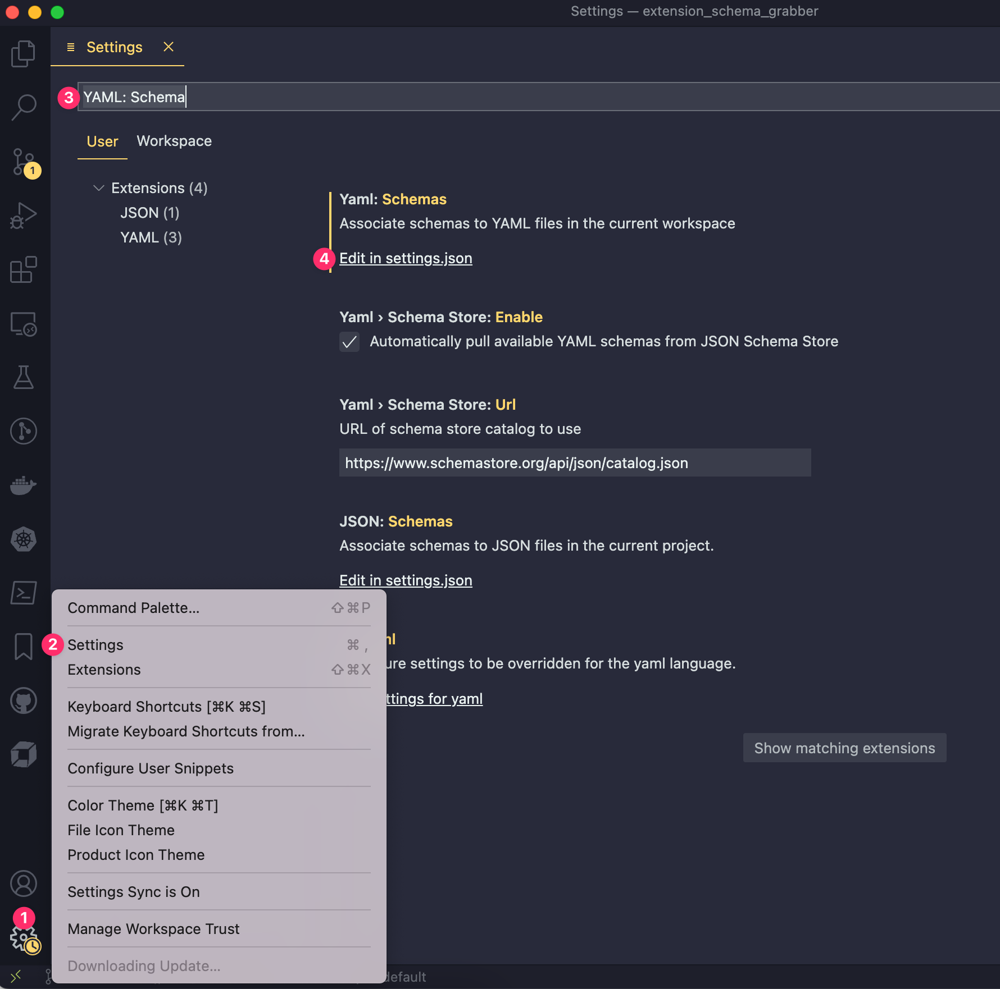
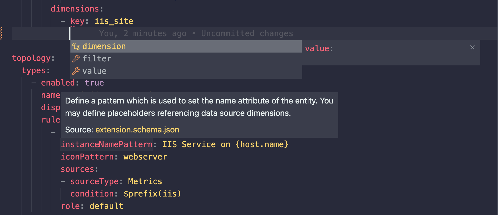

# Schema Grabber


## Setup

1. Rename the `config.yaml.template` file to `config.yaml` 

2. Provide the **tenant**, **token** and **path** where you would like to store the schema files.
   
### With Poetry 

See [Poetry docs](https://python-poetry.org/docs/) for info on setting up this dependency management tool.

```zsh
poetry install
poetry shell
```

### OR Using Pip 

```zsh
python -m venv venv
source venv/bin/activate
pip install -r requirements.txt
```


## Usage

```zsh
python ./get_schemas.py
```

## Result

Based on your chosen path you will get a sub-folder for each version of the schemas.

```zsh
❯ tree -d ~/.schemas
├── 1.213.0
├── 1.215.0
├── 1.217.0
├── 1.218.0
├── 1.223.0
├── 1.225.0
├── 1.226.0
├── 1.228.0
├── 1.229.0
├── 1.230.0
├── 1.231.0
├── 1.233.0
├── 1.235.0
├── 1.238.0
├── 1.239.0
├── 1.240.0
├── 1.241.0
├── 1.242.0
├── 1.245.0
├── 1.249.0
└── 1.250.0
```

Each sub-folder will contain the schema files

```zsh
❯ tree ~/.schemas/1.250.0
├── event.templates.schema.json
├── extension.schema.json
├── gcp.schema.json
├── generic.relationships.schema.json
├── generic.types.schema.json
├── log.events.schema.json
├── log.processing.rule.schema.json
├── metric.metadata.schema.json
├── metric.query.schema.json
├── metric.schema.json
├── metric.stored.query.schema.json
├── processes.schema.json
├── prometheus.schema.json
├── python.schema.json
├── screen.actions.schema.json
├── screen.breadcrumbs.types.schema.json
├── screen.card.charts.schema.json
├── screen.card.entities.list.schema.json
├── screen.card.events.schema.json
├── screen.card.logs.schema.json
├── screen.card.message.schema.json
├── screen.card.problems.schema.json
├── screen.card.properties.schema.json
├── screen.chart.commons.schema.json
├── screen.chart.definition.schema.json
├── screen.chart.type.graph.schema.json
├── screen.chart.type.pie.schema.json
├── screen.chart.type.single.schema.json
├── screen.details.filtering.schema.json
├── screen.details.injections.schema.json
├── screen.details.settings.schema.json
├── screen.filtering.types.schema.json
├── screen.list.filtering.schema.json
├── screen.list.injections.schema.json
├── screen.list.settings.schema.json
├── snmp.schema.json
├── snmptraps.schema.json
├── sql.schema.json
├── topology.schema.json
└── wmi.schema.json
```

## Setup Schema Validation in VS Code

A [similar](https://www.dynatrace.com/support/help/extend-dynatrace/extensions20/extension-yaml_) process is described in the Dynatrace documentation. 

1. Install the extension: YAML [redhat.vscode-yaml](https://marketplace.visualstudio.com/items?itemName=redhat.vscode-yaml)
2. Configure the extension. Go to:
   1. The gear icon
   2. Settings
   3. Search for "`Yaml: Schema`"
   4. "Edit in `settings.json`"




3. Add a block like this to your `settings.json` file choosing the version of the schema you would like to validate against:

```json
{
    "yaml.schemas": {
        "/Users/user.name/schemas_tmp/1.250.0/extension.schema.json": [ 
            "extension.yaml"
        ]
    }
}
```

Then you should see yaml validation hints like this:

